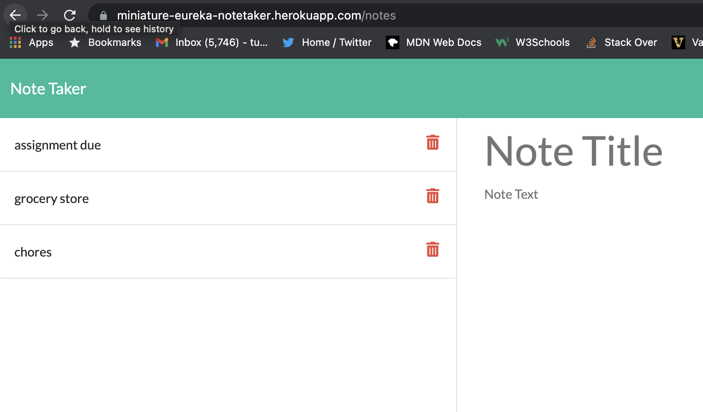

# Note Taker Starter Code

## Description
A minimalist app for recording and retrieving notes. The front end offers a simple, tidy UI, and the back end relies on the tried and trusted node.js and express. Uses a unique id for each note in order to allow for accurate deletion of individual notes.

## Languages
JavaScript
HTML
CSS
node
express
bootstrap
heroku

## Screenshot

## Deployed Link
https://miniature-eureka-notetaker.herokuapp.com/notes

## Credits
Made by Thomas Upchurch
thomascupchurch@gmail.com
github.com/thomascupchurch
